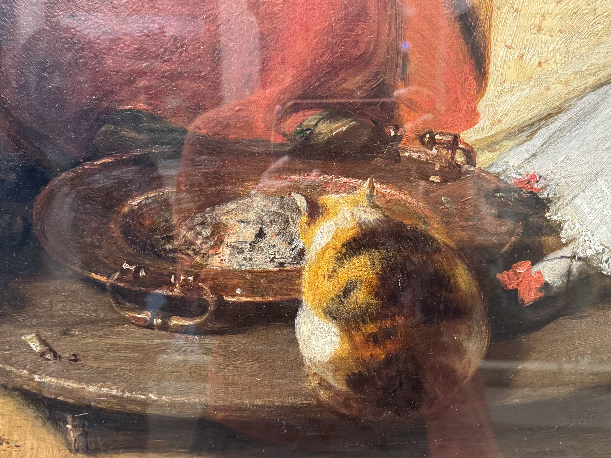

+++
title = '夏日剪贴簿'
date = '2025-08-24T20:51:24-05:00'
description = "毫无责任，纯粹陷入迷狂。哪怕只是那么一分钟。"
categories = [
    "走走"
]
tags = [
    "日常"
]
image = "summer2025.jpg"
draft = false
+++

> 这个夏天快要过完了。
> 
> 体感上感觉好像没特别做什么，但在即将结束的当口回头一望，意识到也许这是对人生有重大意义的夏天。向外确实接收了很多新信息新知识，不过更显著的变化似乎是在自我内部，而最重要的那个可供追溯的片刻发生在7月15日（见下），埋在日复一日的意识流中。
>
> 三月开始尝试偶尔手写日记，那时还没有预见到之后生活中会发生什么。一开始只有用笔颜色的变化，日期也不连贯，但特别闲的七月有常常写，还尝试了涂鸦和不同的排版，勉强可以算做一种手帐，但八月一忙起来就又恢复最无聊的信笔直书，实际上连本子都没怎么打开过，又开始在电脑上打字。
>
> 翻看这些只有夏天才有余裕写写画画的手记，触感格外好，有伏案劳作过的痕迹。挑挑拣拣敲键盘/复制粘贴完才发现，很多时候起笔都是在做些最日常不过的事：洗澡、步行、晾衣服。因为不需要有意关注重复性的身体动作，大脑放空，反而灵光乍现。
> 
> 日期标在文段后的括号里。（6.12）就是2025年6月12日的意思，以此类推。

也是刚刚躺在床上环顾四周的时候突然意识到，我切切实实要在这里度过还有一个半月的时间啊。这里就是我小小的栖身之所。可是紧接着又升起一种强烈的漂泊感。住所不断变动的这一年，身外事不断变动的这一年，要怎么样维持内心的平静，要怎么样学会随波逐流（in the sense of 受到水流的冲击然而身体顺其自然、内心可以岿然不动）。……在这若即若离的京都之夏，又突然发现我好像可以重新开始相信，重新愿意相信了。高中时反复听的那首日语歌里唱的是，“与其怀疑宁愿选择相信，”疑うより信じていたい。重新相信人的真心，相信那种热情、好奇，可是也相信曾经和此刻仍然怀疑的自己。（6.12）

洗完澡之后泡了在日本的第一次浴缸。理智上知道自己明明什么也没有解决，但整个人在ふわふわ的状态中，全身很轻松，心情很好，烦心事与我隔着一面障壁。（6.15）

洗完澡坐在床上时突然进行了深刻的反思，感觉到日本之后似乎变得特别浮躁。……这种浮躁指的是在这样熙熙攘攘的旅游城市察觉到，我的心随之流于表面地浮沉，没有和任何什么产生深刻思考和新见解的时刻。……而且也意识到，面对变动仍岿然不动地坚定存在，只能向内求。想到我以前犯了多大的错误（愚痴的、执迷的心），总觉得到新的地方、换新的环境就会更开心，却忘记外在的境遇本身不能使我更安宁。通往安宁的路一直在我自身之中。……但这并不是说到哪里都可以。在我深爱的、珍视的人们身边，我会成为更完满的自己。（6.21）

充满惶惑的二十代。不再坚定，不再好学（由谁定义？哪套标准），奋力挣扎探索自己的生活方式、价值观、行事准则。犹豫不安，很多困兽般的思考团团打转。模糊、犹疑，保持注视。（6.29）

刚刚走回家的时候也在想，我以前习惯横冲直撞，是看到什么机会都要把握的人，也有很多想要争取。最近好像变得佛系（。）也许我最近要修炼的是学会等待。等待自己慢慢成熟起来，等待我的时机来临，等待该做决断的时刻到来。在那些时刻没有到来之前，不必执着于将来要做出的抉择，只需要默默等待，尽量妥帖地做好那些我认为重要的事。（6.29）

不过也要提醒自己：这种事情就是会有很多反复的。很多反复，很多痛苦。……反复提醒自己：学会不做好学生。Unlearn that good student in me. Unlearn how to meet people's (and my own) expectations. Unlearn that submissive, quiet, and obedient me. 在逆流时，行动肯定是比顺着惯习要难一些。（6.29）

反复练习心的顺从（这里指的是顺服于自己的意志，以及对外界状态随势而为），意识到平静来自于缓慢、细致、投入地做一件事。心的丰裕大概也由此而来。（7.1）

在停车场前注视巨大的乌云从眼前缓缓飘过，周围寂静无声，（宿舍前的停车场里）整齐停放的车辆也无声无息。在那一刻真切意识到我与物共存于此世，有比我更庞大的所在从天空经过……在这样寂静、窗外唯有市声，室内只有冰箱嗡嗡作响的此刻，我突然觉得是时候向前走，允许愤怒、不满等种种情绪存在，但也要让心慢慢澄明。我不是只有愤怒，不是只有阳奉阴违的尖刺，不是只有那些仅存在一瞬的日常细节中反复纠结、追问的样子。在我之中或许也有更深远、安宁的部分，有许多异军突起的激情、好奇，有白噪音一样暗暗地、远远地响着的声音，甚至也许还存在某种可以被称为智慧的东西。我想找到那些更恒久、稳定的部分，一如每每抬头即可望见的比叡山。（7.15）

一年前还会因为没人和我说话而回宿舍大哭，一年后竟然已经乐在其中：没有说话的压力，也在更好悦纳无话可说、无心假装的自己。（7.21）

对了，最近还发现减少overthink之后的人生（生活）真的开心不少。现在能比较快地意识到自己有overthink的倾向就能打住，多提醒自己几次之后自然而然就会放松下来。告诉自己专注当下、回到当下，好像真的很有效果。草草记录下这些，给这样度过的日子（之前好像很少能有这么纯粹的放松状态）留下一个time stamp，供之后的自己参考。（7.23）

刚刚把衣服一件件从洗衣机里拎出来拉平挂好的时候突然意识到，不知道为什么感到在这个夏天有了很多成长，似乎成为更加成熟的人类。对于自身存在开始有了一种长久的安稳感受，激变过后进入更加紧密压实的坚定状态。明明没有觉得在这里学到很多东西（intellectually），没有知识暴打大脑后疲惫又满足的感觉，可又确实意识到一种关于自我的充实感。好像还是学到了什么很珍贵的东西，但究竟从何而来又是几时学到却很难说，只好附会在那个夏夜傍晚停车场前远望过片刻的暮云。是京都的云教会我这些的。
反复听到同学和朋友问起项目结束的感受。也这样自问过。可是答案几无变化：充其量仅是一种淡淡的恍惚，没有不舍，也无留恋，似乎知道这是生活的常态。而从古至今已有太多人用浪漫笔触描绘京都，Kyoto as a construct，其中有很多追究起来很problematic的想象。我不想也不必在此刻再行穿凿。只好说这城市曾容许我八周收纳、整理、停顿片刻的空白，在这意义上并未亏待我。（7.25）

今夜在建筑之间步行，突然觉得两年前的回忆一下子涌回来。对朋友说，每次走过学院门前那片草坪都会想起，Virginia Woolf曾经写过这样一块竖有keep off from the grass牌子的绿地。在那篇文章的结尾她写，文学没有边界，不由他人定义，let us trespass at once。明明已经两年过去，却还是在相似的街道上很自然地振声念出这句子。朋友回说这不是一句很日本的话。我说是的，可是我好喜欢。也许正因此我才喜欢它。（8.3）

回到房间才后知后觉意识到，原来我的夏天很快也要过去了。心境和在即将离开京都的那个夜晚又有不同，虽说目前很难捕捉和描述。如果是从五月初开始算起，这真是发生了很多事的夏季。……仍有很多事悬而未决的此刻，竟意外产生破罐破摔或者说顺其自然的勇气。（8.13）

有些夏天是度过的每一天都很珍惜，当下就知道闪闪发亮的日子很难得；还有一些就像今年的一样顺手挥霍掉，拼接起来却仍然是个很不赖的暑假。夏天是不是就是这样呢。鼓噪的，燥热的，滑溜溜从手里一下子就钻过去。（8.13）

坐在Midnight Tears这个作品前十分钟，默默观看笔触细腻、反复描摹和覆盖过的画作；缓缓走近另一张肖像时，突然注意到主人公小女孩的眼睛涂了亮粉，在角度刚好的灯下闪闪发光，靠近的每一步都有眼波流转。名为Thinker的简笔涂画，有一种出乎意料的安宁。然而纪念品商店的价格一点也不美丽，瞬间破坏展览带来的美好感觉。

出来差不多就是中午，沿着泰晤士河河岸去tate modern的路上看见一只小狗和ta的人类朋友。本来在戏水的小狗听见身后的人类坐下，也凑过去乖乖坐下；人类开始读报，小狗开始看河。有些片刻，他们共享食物。两个生灵，似乎因为已经陪伴在彼此身边很久，养出一种不必付诸言语的默契。那种默契非常美好，我悄悄从桥上往下看。

下午在tate modern的经历也很好。主要倒不是艺术品，最喜欢的反而是地下曾经储存油罐的建筑。也是第一次体会到，建筑有这样的神妙，进入时气氛随之一变。读了wall text，忍不住想象这里作为工业建筑的样貌，以及曾在同样静默的穹顶下工作的人与机器。黯淡灯光下，坐在贾科梅蒂的雕塑之间，觉得自己好像置身在极乐迪斯科的结尾处，哈利曾在那座废弃工厂做过一场无可挽回的梦。还有旁边展厅infinities comission的作品，结尾处欢快的音乐和闪烁摇摆的灯光，毫无责任，纯粹陷入迷狂。哪怕只是那么几分钟。（8.19）

那么，就这样戛然而止吧。在京都的某一节课，学音乐的同学L给大家听他作的曲，解释说有些流派认为音乐在停止的那一刻仍在继续。当时的感觉是，这样结束的音乐反而在耳中脑中嗡嗡颤响。夏天也许也是这样，作为残影在眼前蓝蓝粉粉闪烁而过，眼睛眨一眨，就不见了

